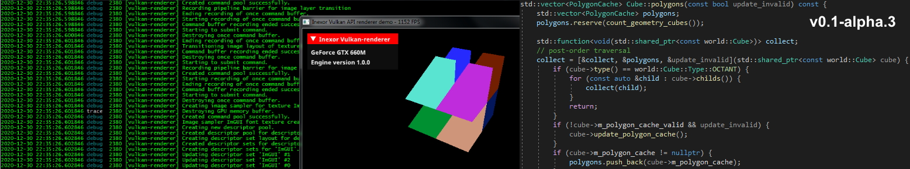

***************
vulkan-renderer
***************

|language| |platforms| |github actions| |readthedocs| |license|

|issues| |last commit| |code size| |contributors| |discord| |downloads|

FAQ and documentation
#####################

.. image:: documentation/source/images/inexor2.png

Inexor is an open-source project which combines modern C++ with Vulkan API.

Inexor’s current main objective is the development of a new octree game engine based on C++17 and Vulkan API 1.1.

`Click here <https://inexor-vulkan-renderer.readthedocs.io/en/latest/>`__ to read our faq and documentation.

Inexor is licensed under the MIT license.

.. Badges.

.. |language| image:: https://img.shields.io/badge/language-C%2B%2B17-brightgreen

.. |platforms| image:: https://img.shields.io/badge/platforms-Linux%20%26%20Windows-brightgreen

.. |github actions| image:: https://img.shields.io/github/workflow/status/inexorgame/vulkan-renderer/Build
   :target: https://github.com/inexorgame/vulkan-renderer/actions?query=workflow%3A%22Build%22

.. |discord| image:: https://img.shields.io/discord/698219248954376256?logo=discord
   :target: https://discord.com/invite/acUW8k7
   
.. |license| image:: https://img.shields.io/github/license/inexorgame/vulkan-renderer?color=brightgreen
   :target: https://inexor-vulkan-renderer.readthedocs.io/en/latest/license/main.html

.. |contributors| image:: https://img.shields.io/github/contributors/inexorgame/vulkan-renderer
   :target: https://inexor-vulkan-renderer.readthedocs.io/en/latest/contributing/contributors.html

.. |downloads| image:: https://img.shields.io/github/downloads/inexorgame/vulkan-renderer/total?color=brightgreen

.. |readthedocs| image:: https://readthedocs.org/projects/inexor-vulkan-renderer/badge/?version=latest
   :target: https://inexor-vulkan-renderer.readthedocs.io

.. |last commit| image:: https://img.shields.io/github/last-commit/inexorgame/vulkan-renderer

.. |issues| image:: https://img.shields.io/github/issues/inexorgame/vulkan-renderer
   :target: https://github.com/inexorgame/vulkan-renderer/issues

.. |code size| image:: https://img.shields.io/github/languages/code-size/inexorgame/vulkan-renderer
