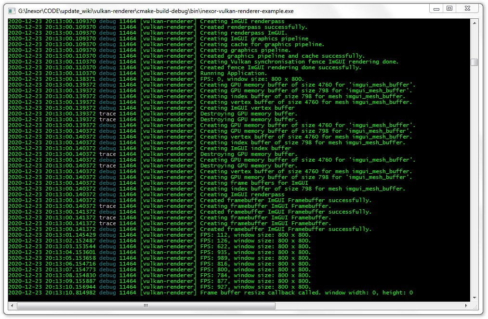

Logfiles
========

Inexor uses `spdlog <https://github.com/gabime/spdlog>`__ for both console logging and logfiles.

The log output which can be seen in the console will also be written to ``vulkan-renderer.log`` in the root directory.

You can open and read this logfile with a text editor of your choice.

We are using the following log entry format ``%Y-%m-%d %T.%f %^%l%$ %5t [%-10n] %v``.

- ``%Y`` is the year.
- ``%m`` is the month (01 to 12).
- ``%d`` is the day of month (01 to 31).
- ``%T`` is `ISO 8601 <https://en.wikipedia.org/wiki/ISO_8601>`__ time format (HH:MM:SS).
- ``%f`` is the microsecond part of the current second.
- ``%^%l%$`` is the `color-coded <https://github.com/gabime/spdlog/wiki>`__ log level.
- ``%5t`` is the thread id formatted to a string of length 5.
- ``[%-10n]`` is the name of the logger, limited to 10 characters.
- ``%v`` is the log message.

For more information, check out spdlog's documentation about `custom formatting <https://github.com/gabime/spdlog/wiki/3.-Custom-formatting>`__.

**Use the following rules for logging**:

- Don't use ``std::cout`` or ``printf`` or similar. Just use spdlog instead.
- Place as many log messages to your code as possible.
- End log messages with a ``.`` to show that the message is finished.
- Use all log levels as you need it: ``spdlog::trace``, ``spdlog::info``, ``spdlog::debug``, ``spdlog::error``, ``spdlog::critical``. 
- You can print variables with spdlog (see `this reference <https://fmt.dev/latest/syntax.html>`__) because it is based on `fmt library <https://github.com/fmtlib/fmt>`__.
- Use direct API calls like ``spdlog::debug("Example text here");`` instead of creating your own logger name for now. We will come up with a strategy for logger hierarchy later.
