RenderDoc
=========

- `RenderDoc <https://renderdoc.org/>`__ is a free and open source graphics debugger for Vulkan API (and other APIs) developed by `Baldur Karlsson <https://github.com/baldurk>`__.
- It is a very powerful graphics debugging and visualisation tool which makes debugging Vulkan application as easy as possible.
- Inexor has full RenderDoc integration. This includes `internal resource naming using Vulkan debug markers <https://www.saschawillems.de/blog/2016/05/28/tutorial-on-using-vulkans-vk_ext_debug_marker-with-renderdoc/>`__.
- The following tutorial shows how to debug Inexor using RenderDoc.
- You can read up more details in `RenderDoc's documentation <https://renderdoc.org/docs/getting_started/quick_start.html>`__.

RenderDoc Tutorial for Windows
------------------------------

Step 1: Open Inexor in Visual Studio and add a breakpoint before Vulkan initializsation
^^^^^^^^^^^^^^^^^^^^^^^^^^^^^^^^^^^^^^^^^^^^^^^^^^^^^^^^^^^^^^^^^^^^^^^^^^^^^^^^^^^^^^^

- The best spot would be right after ``main()``:

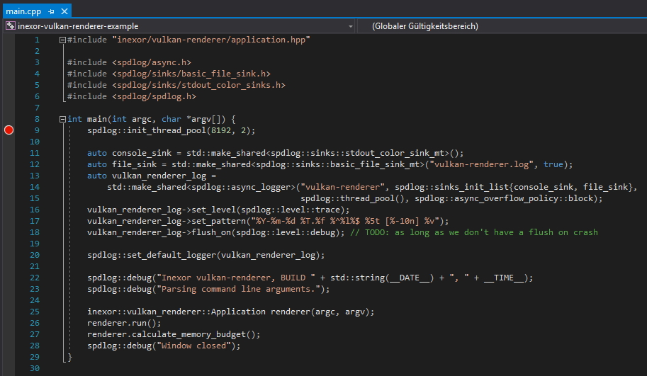

Step 2: Open RenderDoc.
^^^^^^^^^^^^^^^^^^^^^^^

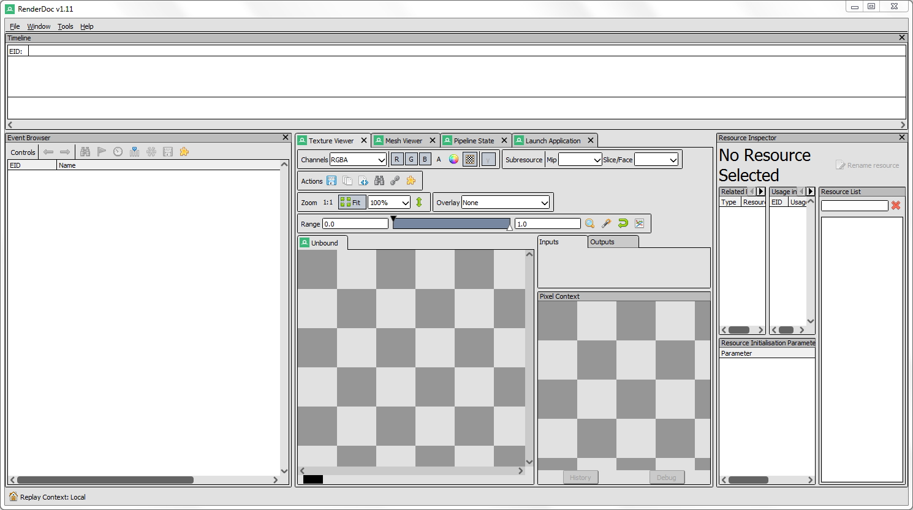

Step 3: Start debugging inexor-vulkan-renderer and halt at the breakpoint
^^^^^^^^^^^^^^^^^^^^^^^^^^^^^^^^^^^^^^^^^^^^^^^^^^^^^^^^^^^^^^^^^^^^^^^^^

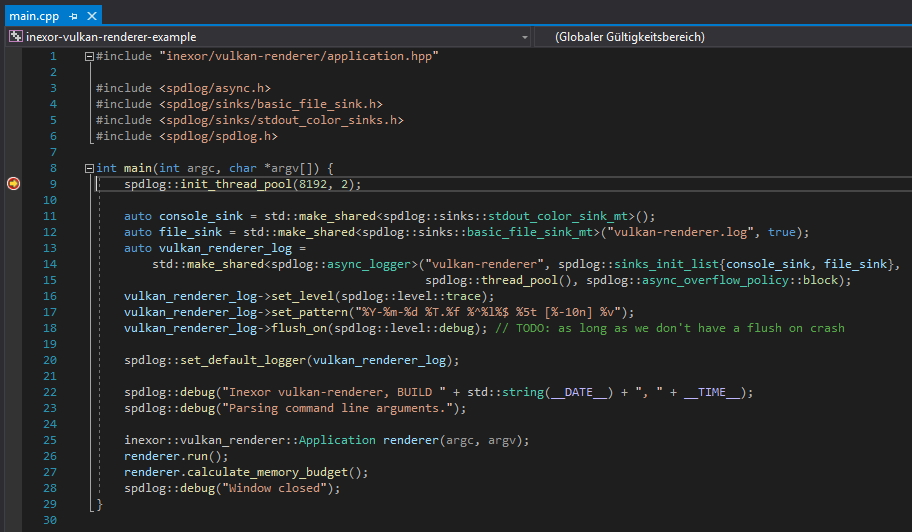

Step 4: "Inject into process" inexor-vulkan-renderer.exe using RenderDoc
^^^^^^^^^^^^^^^^^^^^^^^^^^^^^^^^^^^^^^^^^^^^^^^^^^^^^^^^^^^^^^^^^^^^^^^^

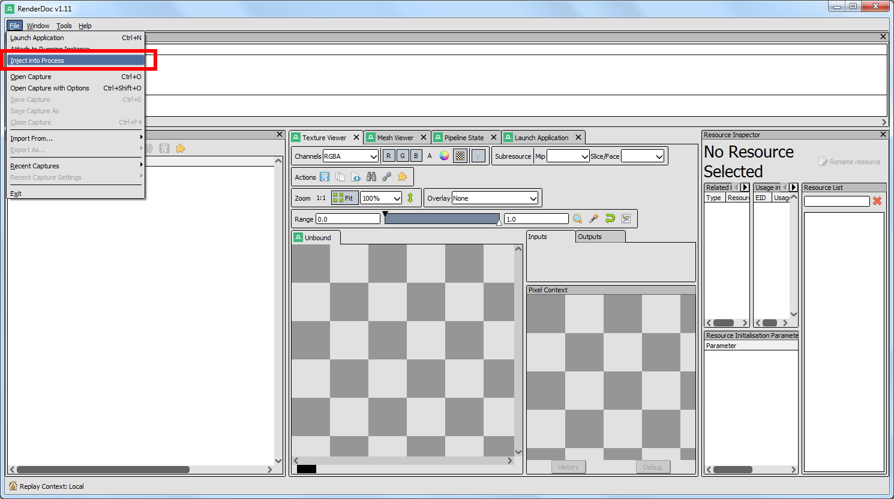

Step 4: Search for "inexor-vulkan-renderer.exe" and click "inject"
^^^^^^^^^^^^^^^^^^^^^^^^^^^^^^^^^^^^^^^^^^^^^^^^^^^^^^^^^^^^^^^^^^

- You will see a warning Windows Firewall the first time you do this.
- This is because RenderDoc is reading memory from inexor-vulkan-renderer.
- Accept the Windows Firewall warning to allow RenderDoc to read memory.

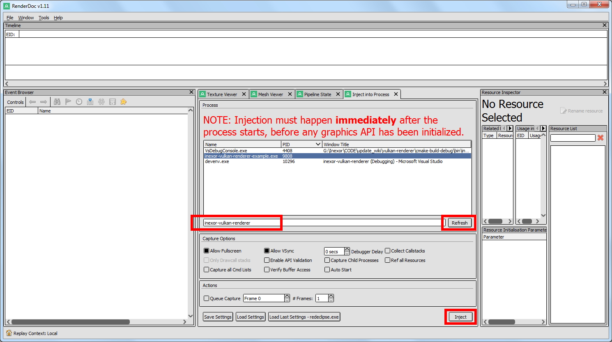
    
Step 5: Continue debugging in Visual Studio
^^^^^^^^^^^^^^^^^^^^^^^^^^^^^^^^^^^^^^^^^^^

- RenderDoc should now look like this.

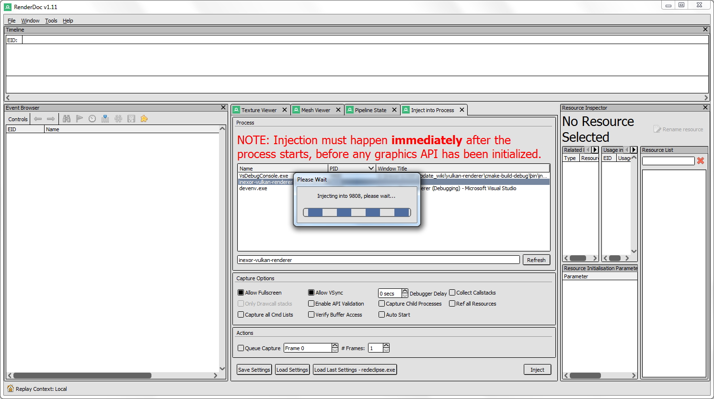

- Press ``F5`` to continue program execution from the breakpoint.
- RenderDoc is now connected to inexor-vulkan-renderer:

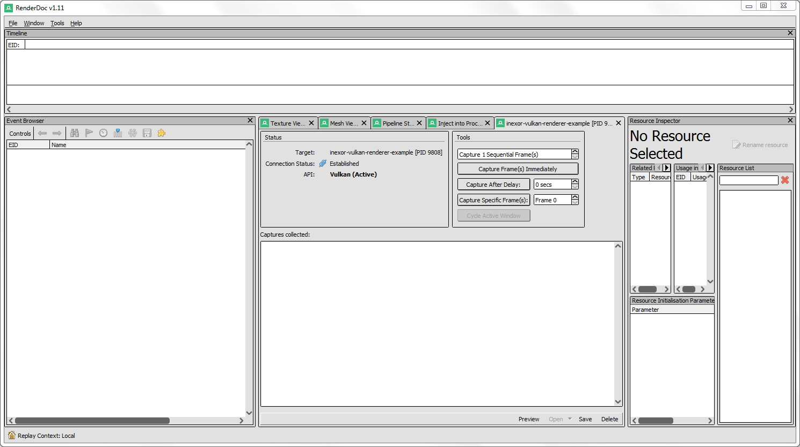
    
- You can see RenderDoc's overlay in inexor-vulkan-renderer.exe:
    
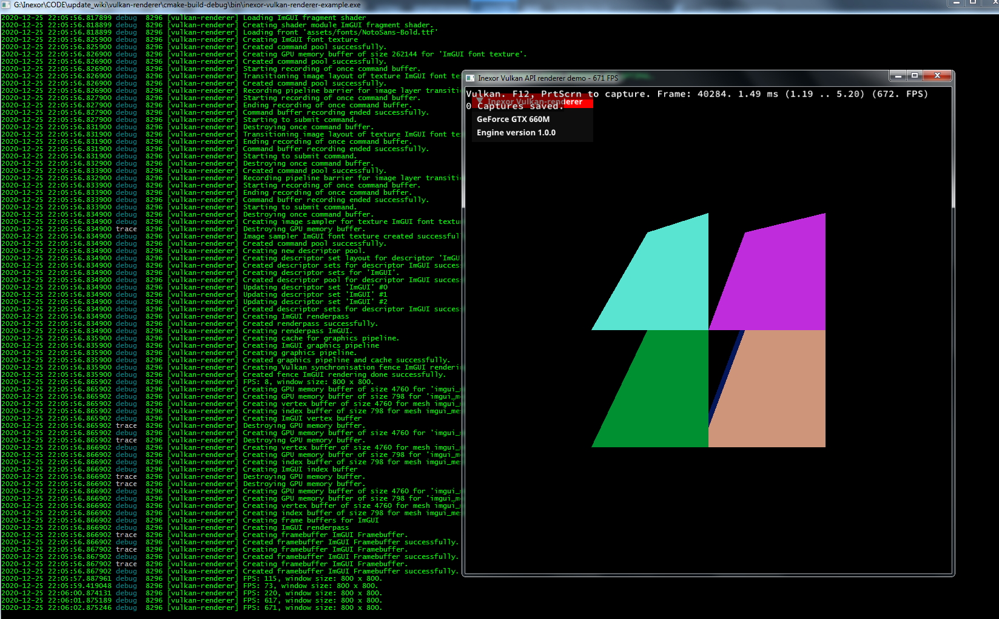

Step 6: Debug inexor-vulkan-renderer.exe as usual and press F12 to take RenderDoc snapshots
^^^^^^^^^^^^^^^^^^^^^^^^^^^^^^^^^^^^^^^^^^^^^^^^^^^^^^^^^^^^^^^^^^^^^^^^^^^^^^^^^^^^^^^^^^^

- You can take multiple snapshots with either ``PRINT`` or ``F12`` key.

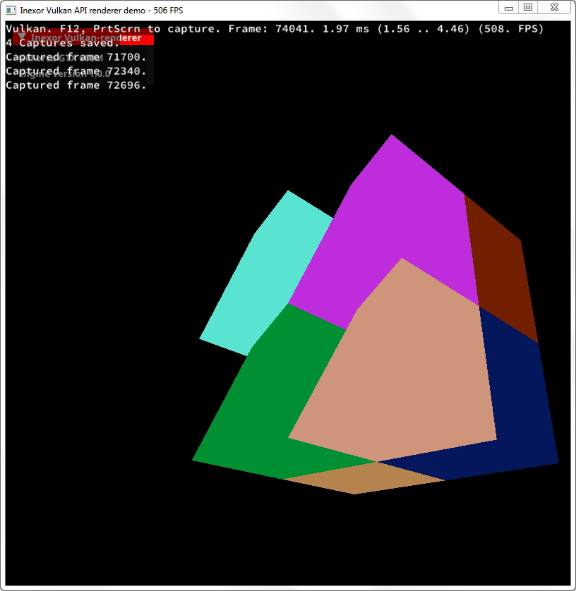

- You can see the snapshots in RenderDoc right after you took them:

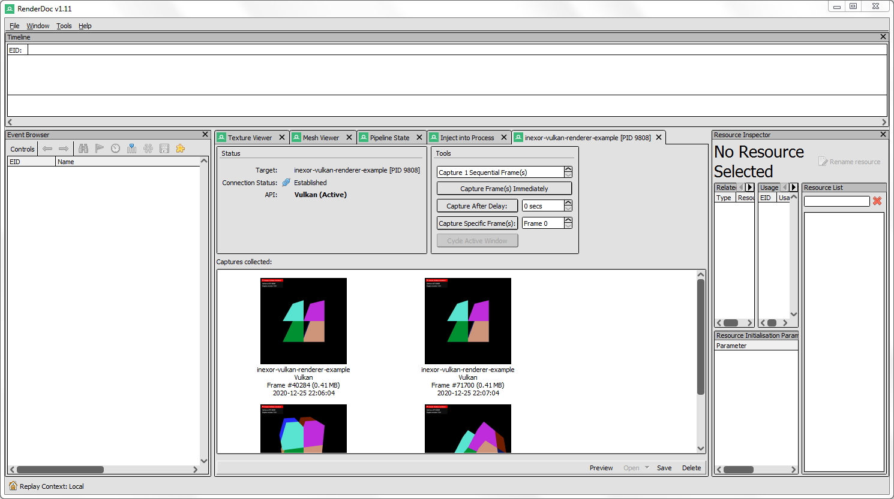

Step 7: Open a snapshot to analyze the rendering of this frame
^^^^^^^^^^^^^^^^^^^^^^^^^^^^^^^^^^^^^^^^^^^^^^^^^^^^^^^^^^^^^^

- Double click on a snapshot to open it:

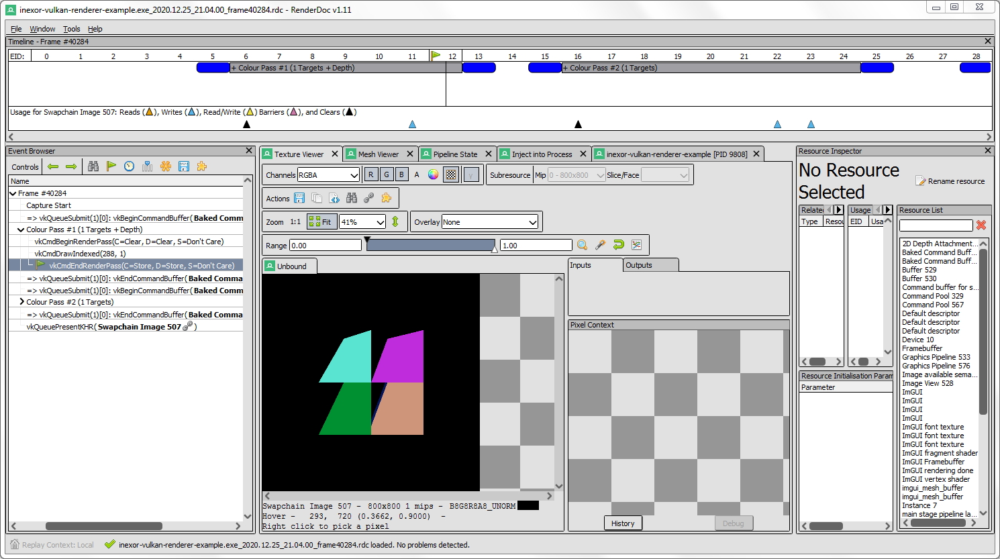

- Have fun inspecting!
