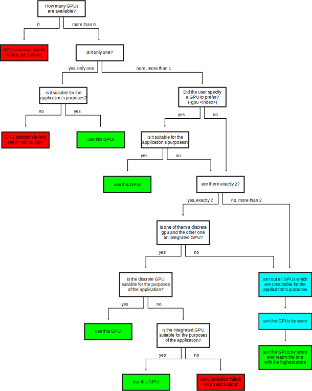

GPU selection mechanism
=======================

- Every graphics card is a gpu, but not every GPU is a (discrete) graphics card.
- For example, some GPUs are integrated into the main processor.
- If a certain GPU is not visible for Vulkan (vkEnumeratePhysicalDevices `<https://www.khronos.org/registry/vulkan/specs/1.2-extensions/man/html/vkEnumeratePhysicalDevices.html>`__), it does not support Vulkan.
- If multiple GPUs are available on the system, the user can either specify which one should be used or let the engine select an appropriate GPU automatically.
- The user can specify which GPU to prefer by using ``--gpu <index>`` as command line argument.
- The ``<index>`` is the array index, **starting from 0**.
- The engine will verify that ``<index>`` is a valid value.
- The engine will check if the GPU is suitable for the engine's purposes. For example we might require GPUs to support geometry shaders in the future.
- If no preferred gpu was specified by the user, the specified gpu index is invalid, or the gpu is unsuitable, **automatic gpu selection rules** apply.

Automatic GPU selection rules
-----------------------------

- Automatic gpu selection is part of the so called **settings decision maker**.
- The method which ultimately selects the gpu is ``decide_which_graphics_card_to_use`` in `settings_decision_maker.cpp <https://github.com/inexorgame/vulkan-renderer/blob/master/src/vulkan-renderer/settings_decision_maker.cpp>`__.
- Note that we are using a C++17 feature which is called `std::optional <https://en.cppreference.com/w/cpp/utility/optional>`__.
- This means if no gpu could be found after all, ``std::nullopt`` will be returned.
- The automated GPU selection mechanism will prefer the discrete GPU over the integrated GPU when exactly 2 GPUs are available.

