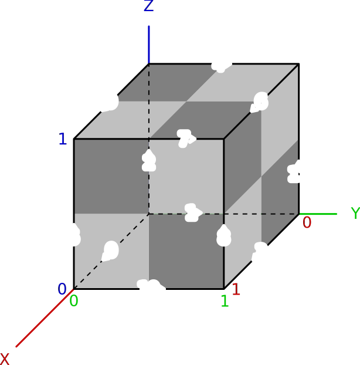
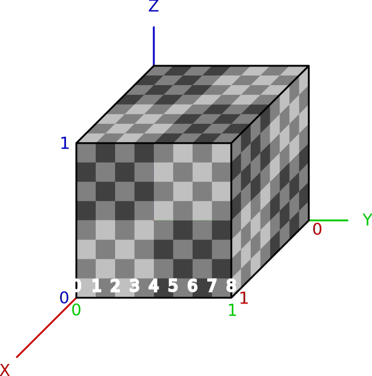

Octree File Format
==================

The Inexor octree format describes the structure of the maps (and even models) created in Inexor.

Octree
------

.. image:: octree.svg
    :alt: Octree Coordinates

The orange are coordinates of the corner, the pink of the block.

The position of a block is always the ``(0, 0, 0)`` corner coordinates.

**Corner and Block Order**

If blocks or corners are ordered, they use this order.

.. image:: octree_corner.svg
    :alt: Corner IDs

.. csv-table:: Corner and Block Order
    :header: ID, Coordinate

    0, "(0, 0, 0)"
    1, "(0, 0, 1)"
    2, "(0, 1, 0)"
    3, "(0, 1, 1)"
    4, "(1, 0, 0)"
    5, "(1, 0, 1)"
    6, "(1, 1, 0)"
    7, "(1, 1, 1)"

**Edge Order**

- All edges are going into the positive direction of the axis.
- The beginning of the edge is always the smaller corner id.
- If you look at a face, the edges are always numbered with an offset of 3.
- The edges are ordered counter-clockwise starting from the axis.
- A negative ID indicates the reverse direction (-axis).

.. csv-table:: Edge Order
    :header: ID, Corner ID Tuple

    0, "(0, 4)"
    1, "(0, 2)"
    2, "(0, 1)"
    3, "(2, 6)"
    4, "(1, 3)"
    5, "(4, 5)"
    6, "(3, 7)"
    7, "(5, 7)"
    8, "(6, 7)"
    9, "(1, 5)"
    10, "(4, 6)"
    11, "(2, 3)"

**Indentation**

Every cube can be indented at each corner to all axis by 8 steps. In total there are 9 position/level on each axis.
The following diagram shows the indentation levels of Corner 1 on the x-axis.

**Neighbors**

.. csv-table:: Neighbor Order
    :header: ID, Relative Coordinates

    0, "(-1, -1, -1)"
    1, "(-1, -1, 0)"
    2, "(-1, -1, 1)"
    3, "(-1, 0, -1)"
    4, "(-1, 0, 0)"
    5, "(-1, 0, 1)"
    6, "(-1, 1, -1)"
    7, "(-1, 1, 0)"
    8, "(-1, 1, 1)"
    9, "(0, -1, -1)"
    10, "(0, -1, 0)"
    11, "(0, -1, 1)"
    12, "(0, 0, -1)"
    13, "(0, 0, 1)"
    14, "(0, 1, -1)"
    15, "(0, 1, 0)"
    16, "(0, 1, 1)"
    17, "(1, -1, -1)"
    18, "(1, -1, 0)"
    19, "(1, -1, 1)"
    20, "(1, 0, -1)"
    21, "(1, 0, 0)"
    22, "(1, 0, 1)"
    23, "(1, 1, -1)"
    24, "(1, 1, 0)"
    25, "(1, 1, 1)"

Format Specification
--------------------

Using this :doc:`binary format syntax </development/reference/binary-format-specification>`.

**Cube Types**

0 - EMPTY
    The cube does not exist, nothing to render.
1 - SOLID
    One solid cube.
2 - NORMAL
    An indented cube, with at least one intended corner.
3 - OCTANT
    The octree is subdivided into 8 sub cubes.

.. note::

    The Format numbers are just to difference between the formats and not to describe an versioning.

.. raw:: html
    :file: ../../auto-generated/radar.html

.. raw:: html
    :file: ../../auto-generated/radar_rel_inexor_iii.html

Sauerbraten
^^^^^^^^^^^

This part only shows, how Sauerbraten saves the octrees in general. It does not show the whole format.
As Sauerbraten has one cube type more, the formats can only be compared to Inexors partially.

.. code-block::

    | ENDIANNESS : little
    | bit : 1 // A bit, 0 or 1.
    | uByte : 8 // An unsigned byte.

    def get_cube() {
        > uByte (1) : cube_type // cube type, actually only 3 bits are used, but only 4 types (the first two bits, can be compared to our cubes)
        switch (cube_type) {
            case 0: // octant
                // nothing
            case 1: // empty
                // nothing
            case 2: // solid
                // nothing
            case 3: // normal
                for (0..11 : corner_number) {
                    > uByte (1) // edge indent
                }
        }
    } // get_cube
    get_cube()

Inexor I
^^^^^^^^

File Extension: ``.nxoc`` - Inexor Octree

.. code-block::

    | ENDIANNESS : little
    | bit : 1 // A bit, 0 or 1.
    | uByte : 8 // An unsigned byte.
    | uInt : 32 // An unsigned integer.

    > uByte (13) // string identifier: "Inexor Octree"
    > uInt (1) // version

    def get_cube() {
        > bit (2) uByte : cube_type // cube type

        switch (cube_type) {
            case 0: // empty
                // nothing
            case 1: // fully
                // nothing
            case 2: // indented
                for (0..7 : corner_number) {
                    > bit (1) : x_axis // is x axis indented
                    if (x_axis == 1) { // x axis is indented
                        > bit (3) // indentation level as value + 1
                    }
                    > bit (1) : y_axis // is y axis indented
                    if (y_axis == 1) { // y axis is indented
                        > bit (3) // indentation level as value + 1
                    }
                    > bit (1) : z_axis // is z axis indented
                    if (z_axis == 1) { // z axis is indented
                        > bit (3) // indentation level as value + 1
                    }
                }
            case 3: // octants
                for (0..7 : sub_cube) {
                    get_cube() // recurse down
                }
        }
    } // get_cube
    get_cube()

The corner position at one axis is calculated relative from the corner starting as 0 + indentation level.

Inexor II
^^^^^^^^^
File Extension: ``.nxoc`` - Inexor Octree

.. code-block::

    | ENDIANNESS : little
    | bit : 1 // A bit, 0 or 1.
    | uByte : 8 // An unsigned byte.
    | uInt : 32 // An unsigned integer.

    > uByte (13) // string identifier: "Inexor Octree"
    > uInt (1) // version

    def get_cube() {
        > bit (2) uByte : cube_type // cube type

        switch (cube_type) {
            case 0: // empty
                // nothing
            case 1: // fully
                // nothing
            case 2: // indented
                for (0..11 : edge_id) {
                    > bit (2) uByte : indent // edge indentation
                    switch (indent) {
                        case 0: // not indented
                            break
                        case 1: // end corner is indented
                        case 2: // start corner is indented
                            > bit (3) // indentation offset, starting from the specified corner
                            break
                        case 3: // both sides indented
                            > bit (5) // indentation level and offset, see below for more information
                    }
                }
            case 3: // octants
                for (0..7 : sub_cube) {
                    get_cube() // recurse down
                }
        }
    } // get_cube
    get_cube()

**Calculating edge indentation value**

The indentation along the edge axis between two corners presented by a unique value. The indentation level starts with 0 at the starting corner and goes to 8 at the ending corner.
We are assuming that both ends of the edge are indented by at least one. (Start at 0, is actually already indented by one).

Using :math:`i` as the indentation value, :math:`s` as the indentation start position and :math:`o` as the offset between the start and end position.
:math:`i = 8 * s + o - \frac{s^2 + s}{2}; s, o \in [0, 6]; s <= o`

Resulting into values from 0 to 27.

Inexor III
^^^^^^^^^^
The third format takes advantage of the second format for the double-sided indentations, but makes sure that it is easy to read and write and not many bitwise operations have to be done.
Also the cube type is presented by one byte, even if only the first two bits are used.

File Extension: ``.nxoc`` - Inexor Octree

.. code-block::

    | ENDIANNESS : little
    | bit : 1 // A bit, 0 or 1.
    | uByte : 8 // An unsigned byte.
    | uInt : 32 // An unsigned integer.

    > uByte (13) // string identifier: "Inexor Octree"
    > uInt (1) // version

    def get_cube() {
        > uByte (1) : cube_type // cube type, only the first two bits are used.

        switch (cube_type) {
            case 0: // empty
                // nothing
            case 1: // fully
                // nothing
            case 2: // indented
                for (0..11 : edge_id) {
                    > bit (6) // indentation level and offset, see below for more information
                }
            case 3: // octants
                for (0..7 : sub_cube) {
                    get_cube() // recurse down
                }
        }
    } // get_cube
    get_cube()

**Calculating edge indentation value**

The indentation along the edge axis between two corners presented by a unique value. The indentation level starts with 0 at the starting corner and goes to 8 at the ending corner.

Using :math:`i` as the indentation value, :math:`s` as the indentation start position and :math:`o` as the offset between the start and end position.

:math:`i = 10 * s + o - \frac{s^2 + s}{2}; s, o \in [0, 8]; s <= o`

Resulting into values from 0 to 44.
