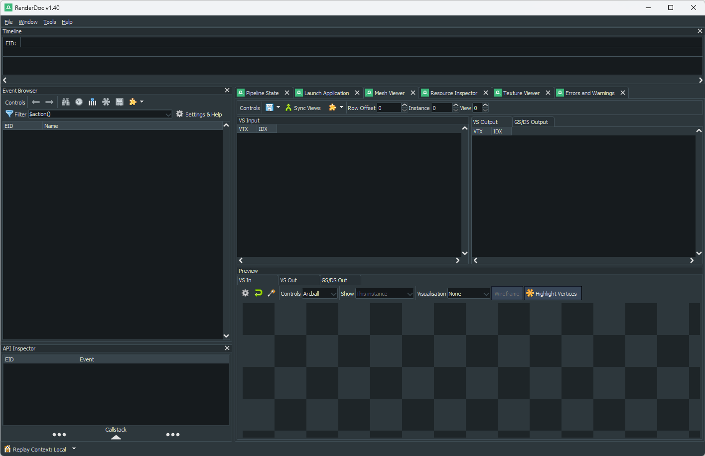
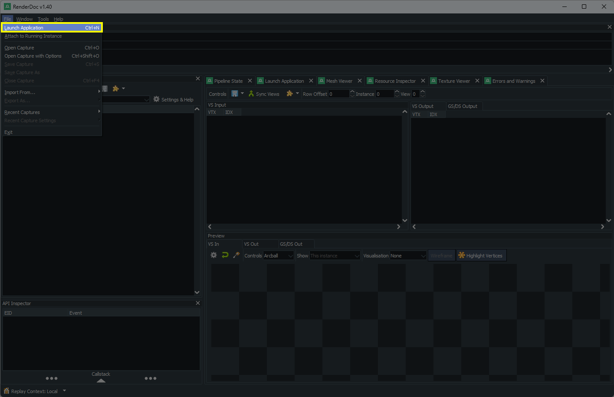
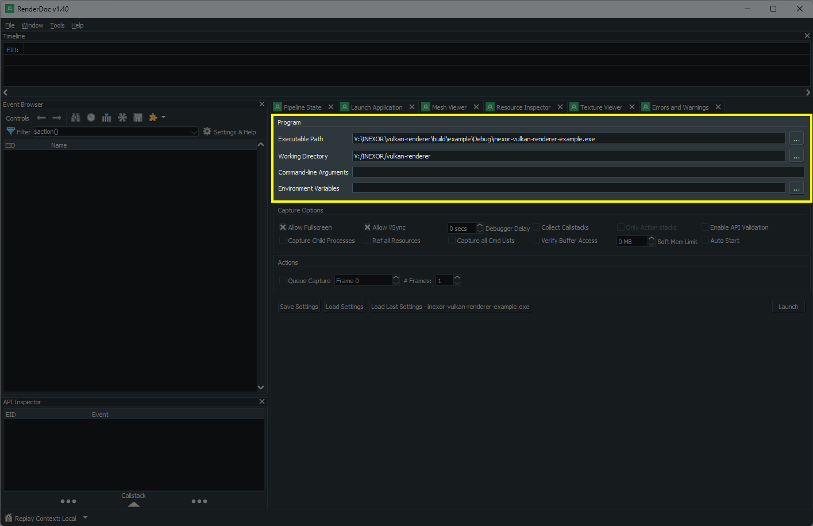
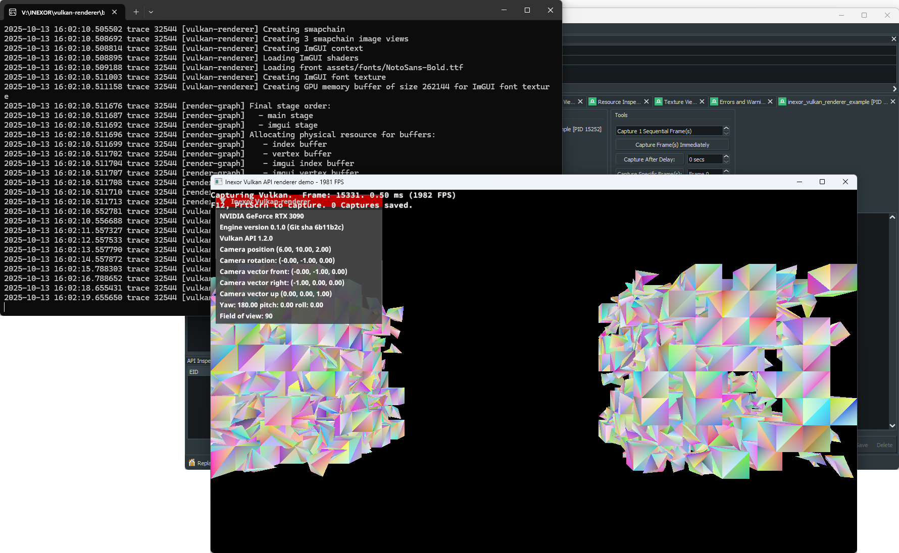
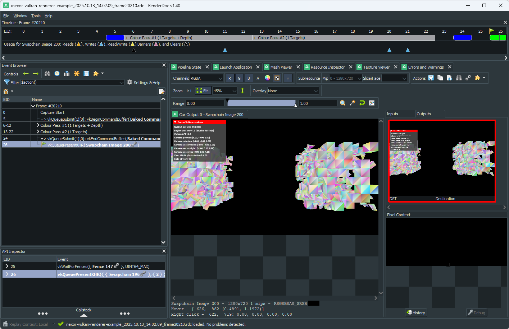

RenderDoc Graphics Debugger
===========================

- `RenderDoc <https://renderdoc.org/>`__ is a powerful, free, and open-source graphics debugger for Vulkan and other APIs.
- You can read more details in `RenderDoc's documentation <https://renderdoc.org/docs/getting_started/quick_start.html>`__.

RenderDoc Tutorial for Windows
------------------------------

- If you encounter a graphics bug or you would like to analyze how ``inexor-vulkan-renderer-example`` works, you can run it easily in RenderDoc by following these steps on Windows:

**STEP 1**: Download, install, and open RenderDoc:

**STEP 2**: Build ``inexor-vulkan-renderer-example`` in Microsoft Visual Studio.

**STEP 3**: In RenderDoc, go to "Launch Application" (or press ``CTRL+N``).

This tab will open in RenderDoc:

**STEP 4**: Specify the path to the ``inexor-vulkan-renderer-example`` executable and also the working directory. If you have several gpus and you would like to use a certain one, specify the ``--gpu <index>`` command line argument in the input field in RenderDoc. See also: :ref:`COMMAND_LINE_ARGUMENTS` and :ref:`AUTOMATIC_GPU_SELECTION`.

.. note::
    Make sure the working directory is really set correctly because otherwise the ``inexor-vulkan-renderer-example`` will crash on start!

**STEP 5**: Click "Launch". You will get a warning from Windows Firewall because RenderDoc is injecting itself into the process for debugging. The application is now running. Press ``F12`` to collect a so called capture of the screen. You can collect as many captures as you like.

**STEP 6**: Close the executable and inspect the captures in RenderDoc.

