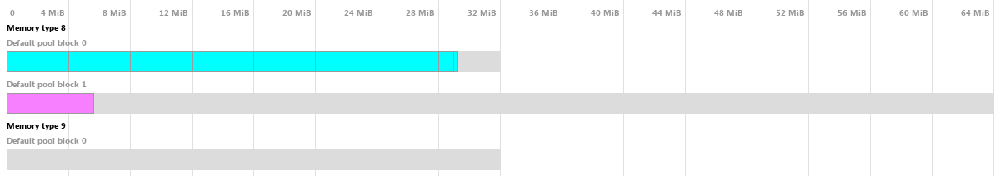

VMA dumps
=========

.. note::
    Read VMA's documentation of this feature `here <https://gpuopen-librariesandsdks.github.io/VulkanMemoryAllocator/html/statistics.html#statistics_json_dump>`__.

.. warning::
    This feature is currently not implemented because we do not yet use ``vmaBuildStatsString``. This page will be updated with  `ticket 538 <https://github.com/inexorgame/vulkan-renderer/issues/538>`__.

- We use `Vulkan Memory Allocator (VMA) <https://github.com/GPUOpen-LibrariesAndSDKs/VulkanMemoryAllocator>`__.
- VMA can export an overview of the current GPU memory allocations into a JSON file which can be converted into an image using `VMA's VmaDumpVis tool <https://github.com/GPUOpen-LibrariesAndSDKs/VulkanMemoryAllocator/tree/master/tools/GpuMemDumpVis>`__.
- This way we can see which memory pools exist, which memory blocks are allocated, and what they are used for. 
- This is a very simple example of such an image generated from a memory dump with `VMA's VmaDumpVis <https://github.com/GPUOpen-LibrariesAndSDKs/VulkanMemoryAllocator/tree/master/tools/GpuMemDumpVis>`__.:

- In march 2020, a `bug in Inexor's early graphics memory management <https://community.khronos.org/t/texture-corruption-when-window-is-resized/105456>`__ caused textures to corrupt on window resize.
- VmaDumpVis helped to resolve the issue by proving the memory consumption increased after each resize, which means the texture memory was simply not freed when the swapchain was recreated.
- This is an example of how VMA and VmaDumpVis make debugging graphics memory easier.
