.. _GETTING_STARTED:

Getting Started
===============

|discord|

If you have any trouble, please `open a ticket on GitHub <https://github.com/inexorgame/vulkan-renderer/issues>`__ or join our `Discord server <https://discord.com/invite/acUW8k7>`__

.. |discord| image:: https://img.shields.io/discord/698219248954376256?logo=discord
   :target: https://discord.com/invite/acUW8k7

.. _SUPPORTED_PLATFORMS:

Required Hardware
-----------------

- You need a graphics card with support for `Vulkan API 1.3 <https://www.vulkan.org/>`__ for both development and also for just running the engine.
- Use `Vulkan Hardware Database <https://vulkan.gpuinfo.org/>`__ to get extensive information about a graphics card's Vulkan API support.
- We will stick to Vulkan API 1.3 for a long time to come and we want to implement all desired features from Vulkan 1.3 before updating to a newer version.
- Older versions of Vulkan API (1.0, 1.1, and 1.2) are no longer supported and will not be supported again in the future.
- We do not support other graphics APIs such as DirectX or OpenGL and we will not support them in the future.

Supported Platforms
-------------------

- We support Windows 11 and Linux distributions for which Vulkan drivers exist.
- We do not support macOS or iOS and we will not support it in the future because it would require us to use `MoltenVK <https://github.com/KhronosGroup/MoltenVK>`__ abstraction layer for Apple's `Metal API <https://developer.apple.com/metal/>`__ to get Vulkan running on those devices.
- We do not yet support `Android <https://source.android.com/docs/core/graphics/implement-vulkan>`__ because this will likely require fundamental changes to the engine, but maybe we will support it in the future.

Required Software for Development
---------------------------------

.. tip::
    Update your **graphics drivers** and also your **Vulkan SDK** as frequently as possible! Updates contain bug fixes, new features, and performance improvements. Both your gaming experience and your game development experience will benefit from this.

This project uses out-of-source builds with `gcc <https://gcc.gnu.org/>`__ and `clang <https://clang.llvm.org/>`__ on Linux as well as `Microsoft Visual Studio 2022 <https://visualstudio.microsoft.com/en/>`__ and `Clang/LLVM for Visual Studio <https://learn.microsoft.com/en-us/cpp/build/clang-support-msbuild?view=msvc-170>`__ on Windows. Our :ref:`CONTINUOUS_INTEGRATION` on GitHub uses all four of those compilers to build both debug and release configuration in our `nightly build <https://github.com/inexorgame/vulkan-renderer/releases/tag/nightly>`__.

In addition to one of these compilers, the following software is required for building the code:

`Vulkan SDK <https://vulkan.lunarg.com/sdk/home>`__
  The Vulkan SDK contains the libraries and tools which are required to work with Vulkan API.

`CMake <https://cmake.org/>`__
  The build system to generate the project files for building the engine, shaders, and documentation.

`Git <https://www.git-scm.com/>`__
  Git version control is used to download (clone) the source code from GitHub.

If you also want to build the documentation, you'll need the following software in addition to the software required for building the code:

`Python <https://www.python.org/>`__ with `pip <https://pypi.org/project/pip/>`__
  Generates the documentation of the project with `Sphinx <https://www.sphinx-doc.org/en/master/index.html>`__

`Doxygen <http://www.doxygen.nl/download.html>`__
  Generates the C++ documentation based on the comments in the source code.

Optional Software
-----------------

`Visual Studio Code <https://code.visualstudio.com/>`__
  A powerful, free, and open-source text editor.

`GitHub Desktop <https://desktop.github.com/>`__
  An open source Git user interface which is easy to use.

`Ninja Build System <https://ninja-build.org/>`__
  A build system that works with CMake to improve speed.

`RenderDoc <https://renderdoc.org/>`__
  A powerful, free, and open-source graphics debugger.

CMake Build Targets
-------------------

.. list-table:: List of CMake build targets.
   :header-rows: 1

   * - Build Target
     - Description
     - Comment
   * - ``inexor-vulkan-renderer``
     - The core engine library
     - 
   * - ``inexor-vulkan-renderer-example``
     - The main executable
     - Requires ``inexor-vulkan-renderer``
   * - ``inexor-vulkan-renderer-tests``
     - `Google Test <https://github.com/google/googletest>`__
     - Requires ``inexor-vulkan-renderer``
   * - ``inexor-vulkan-renderer-benchmark``
     - `Google Benchmark <https://github.com/google/benchmark>`__
     - Requires ``inexor-vulkan-renderer``
   * - ``inexor-vulkan-renderer-documentation``
     - Builds the documentation with `Sphinx <https://www.sphinx-doc.org/en/master/>`__
     -
   * - ``inexor-vulkan-renderer-documentation-linkcheck``
     - `Sphinx linkcheck feature <https://www.sphinx-doc.org/en/master/_modules/sphinx/builders/linkcheck.html>`__
     - Search for broken links

CMake Build Options
-------------------

.. list-table:: List of CMake options.
   :header-rows: 1

   * - CMake Option
     - Description
     - Default Value
   * - ``INEXOR_BUILD_EXAMPLE``
     - Build ``inexor-renderer-example``
     - ``ON``
   * - ``INEXOR_BUILD_TESTS``
     - Build ``inexor-renderer-tests``
     - ``OFF``
   * - ``INEXOR_BUILD_BENCHMARKS``
     - Build ``inexor-renderer-benchmarks``
     - ``OFF``
   * - ``INEXOR_BUILD_DOC``
     - Build the documentation with `Sphinx <https://www.sphinx-doc.org/en/master/>`__
     - ``OFF``
   * - ``INEXOR_BUILD_DOCUMENTATION_USE_VENV``
     - Generate and use a Python virtual environment for the documentation dependencies.
     - ``ON``
   * - ``INEXOR_FORCE_COLORED_OUTPUT``
     - Always produce ANSI-colored output (GNU/Clang only).
     - ``OFF``

.. _BUILD_INSTRUCTIONS:

Building on Windows
-------------------

**STEP 1:** Install Microsoft Visual Studio 2022, Git, CMake, Python, Doxygen, and the Vulkan SDK.

**STEP 2:** Clone the source code from GitHub into any folder (in our example it will be ``V:/INEXOR/``):

.. code-block:: shell-session

    $ git clone https://github.com/inexorgame/vulkan-renderer

Alternatively, download the source code from the `GitHub repository <https://github.com/inexorgame/vulkan-renderer/archive/refs/heads/main.zip>`__ directly.

**STEP 3:** Open CMake:

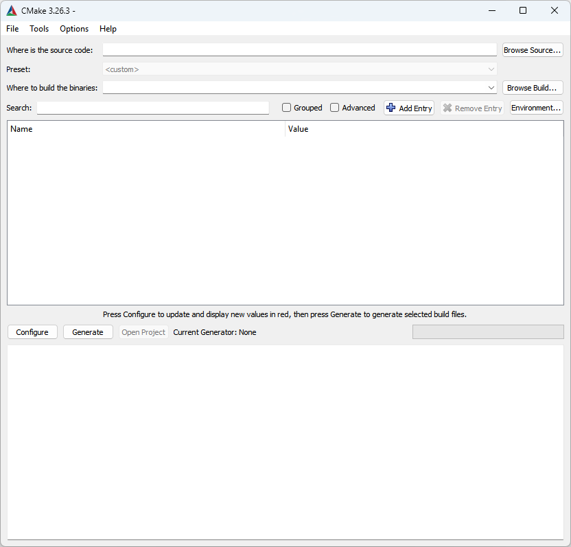

**STEP 4:** Click "Browse Source..." to select the folder that contains the source code. In this example, the path is ``V:/INEXOR/vulkan-renderer``:

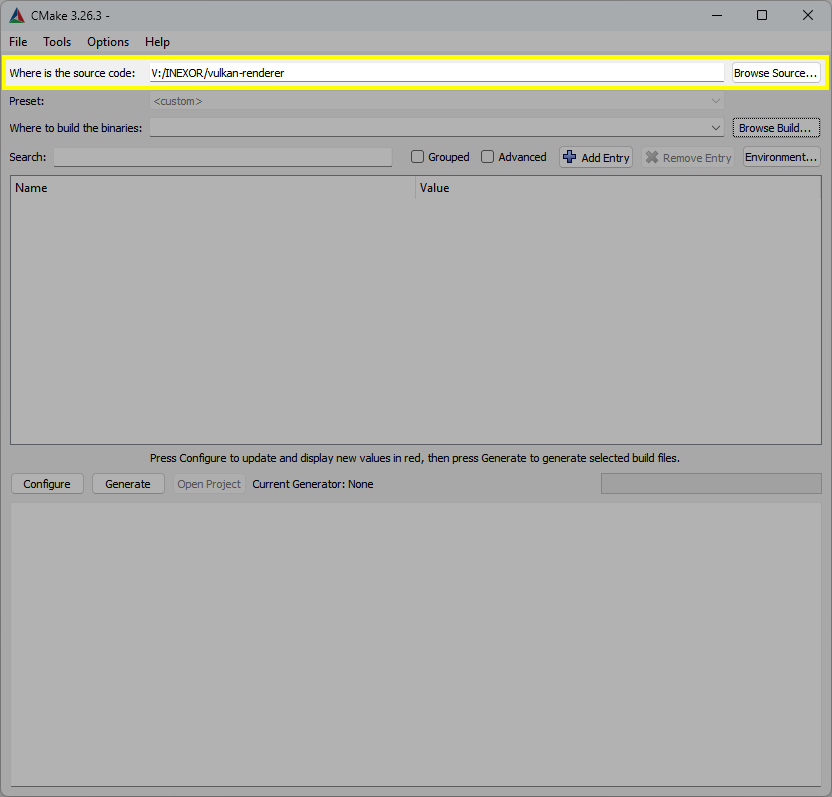

**STEP 5:** Click "Browse Build..." to select a build folder, usually we pick a sub-folder named ``build``:

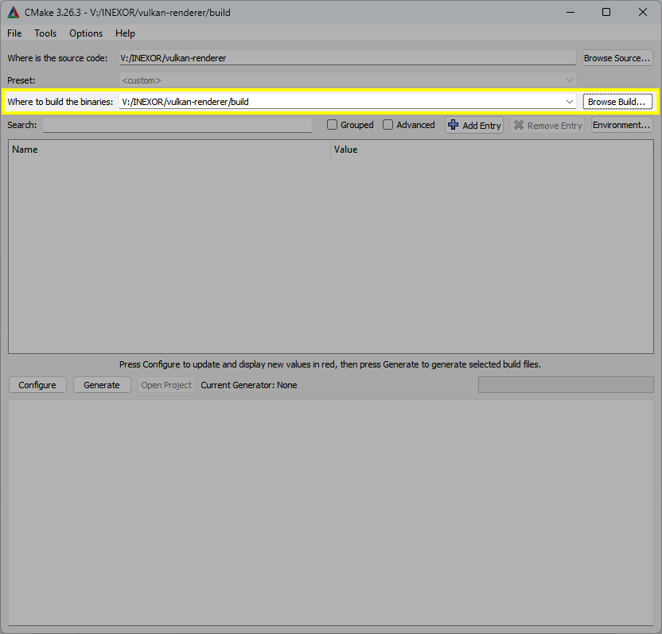

**STEP 6:** Click "Configure". If the ``build`` directory does not exist already, you will see the following dialog. Click "Yes":

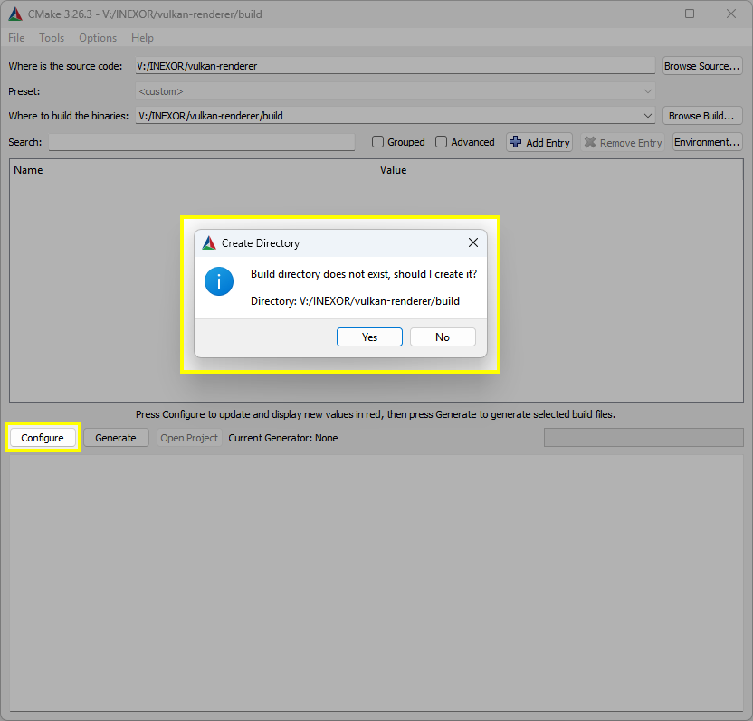

**STEP 7:** Now you can specify the generator for the project and some more options. Because we are using ``Visual Studio 17 2022``, just click "Finish":

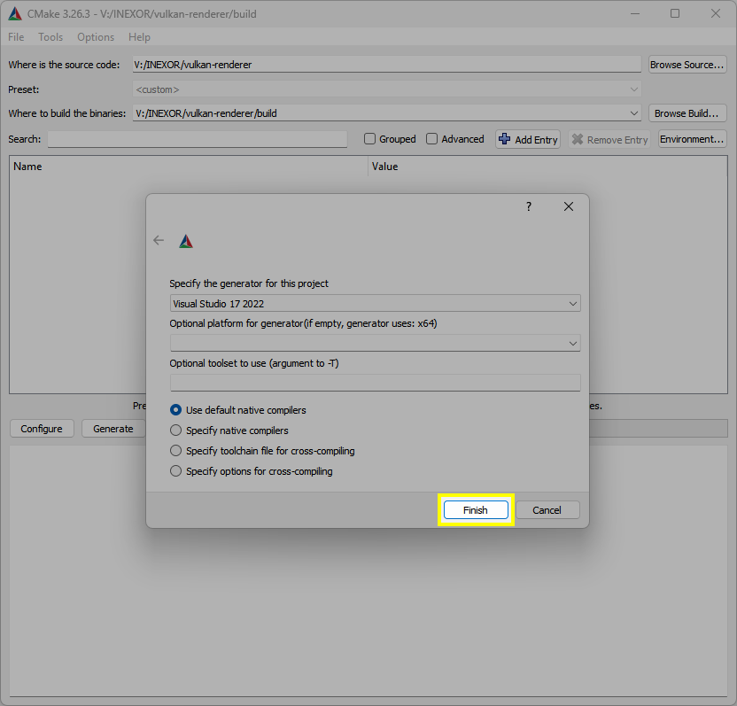

**STEP 8:** Let CMake configuration finish its work. CMake will download all dependencies automatically, which might take some minutes. If everything completed, the console log prints "Configuring done":

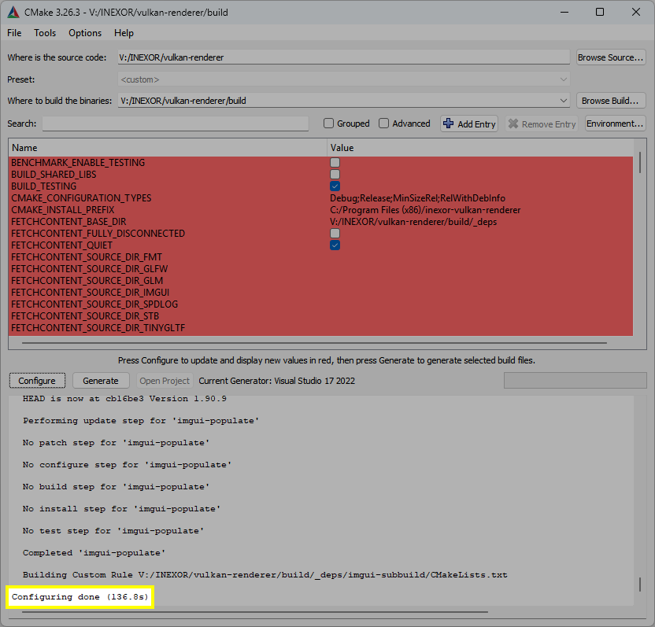

**STEP 9:** We now can configure the CMake build options of this project. You can enter "INEXOR" into the search field to find the options more easily. As you can see, only the ``INEXOR_BUILD_EXAMPLE`` option is enabled by default:

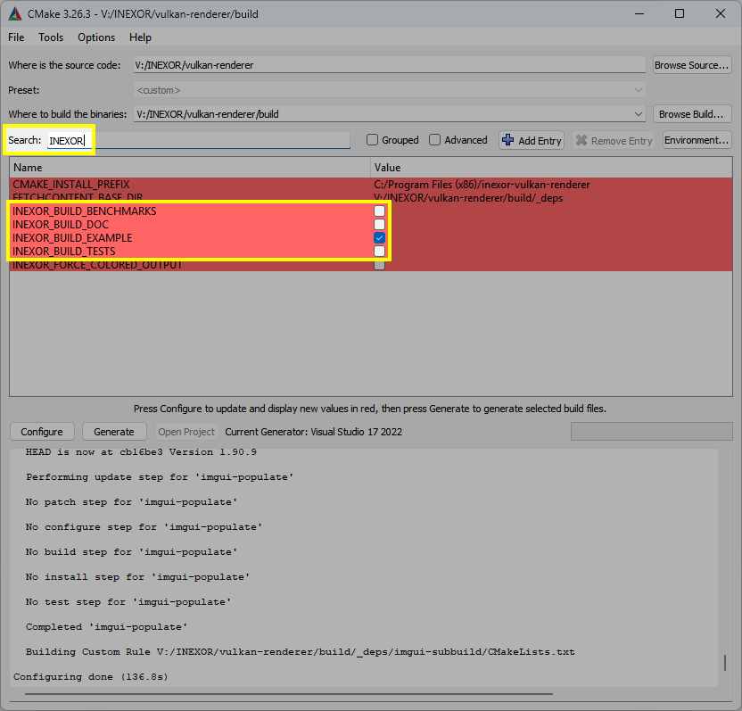

**STEP 10:** In this example, let's enable building benchmarks, tests, and the documentation as well. To do so, set the checkboxes for ``INEXOR_BUILD_BENCHMARKS``, ``INEXOR_BUILD_TESTS``, and ``INEXOR_BUILD_DOC``:

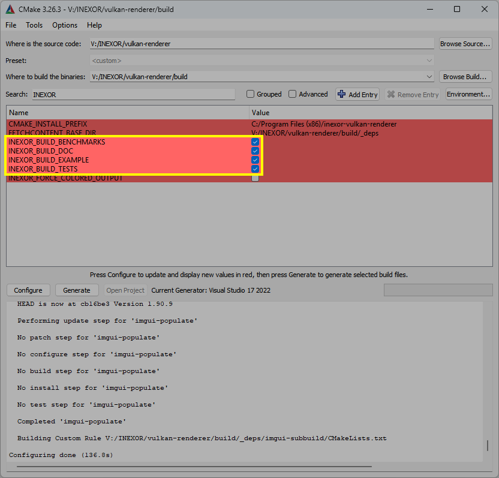

**STEP 11:** Click "Generate" and wait for CMake to complete its work. If everything completed, the console log will print "Generating done":

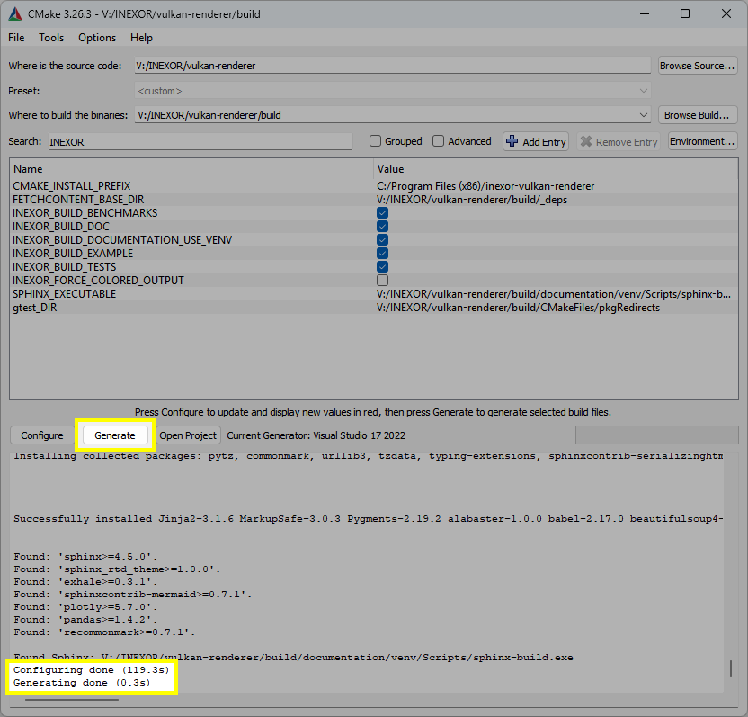

**STEP 12:** CMake successfully generated the Visual Studio project file. Click "Open Project" to open it in directly in Visual Studio:

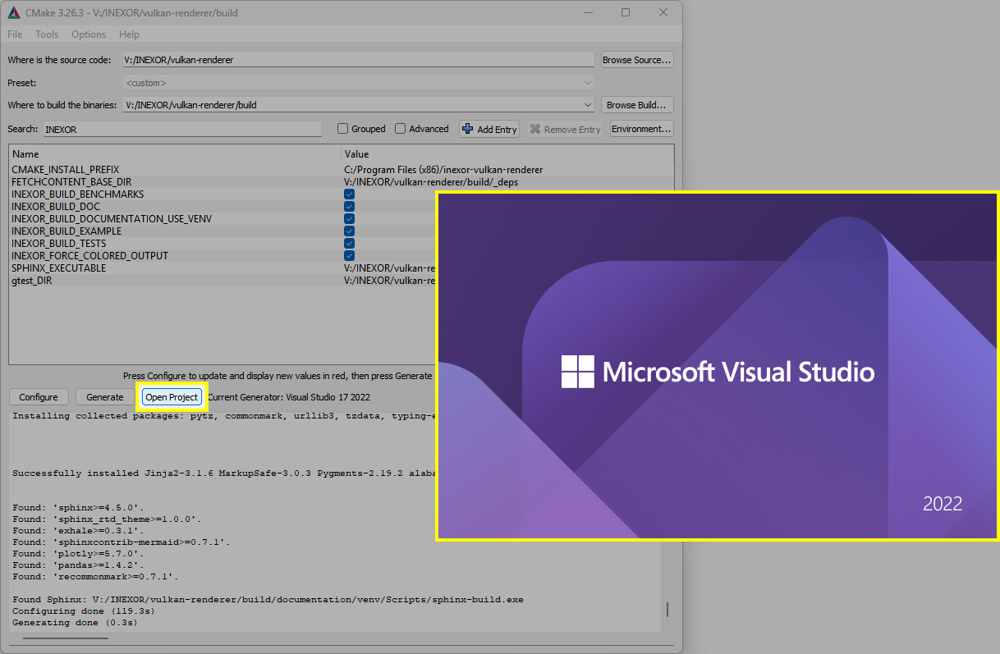

**STEP 13:** You can see that ``inexor-vulkan-renderer-example`` is set as start-up project by default. To build it, right click on it and select "Build".

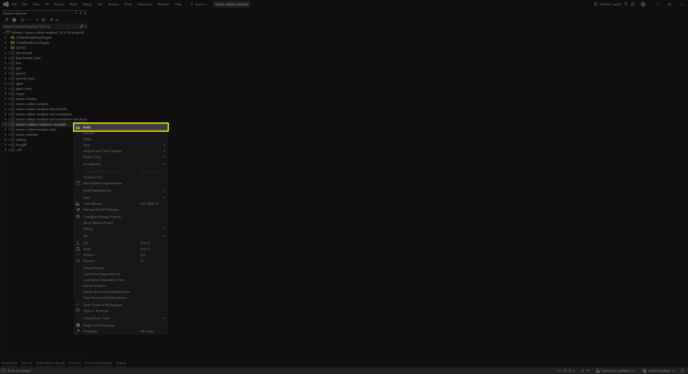

This will also build the core library and the shaders as well. It might take some time to build the project.

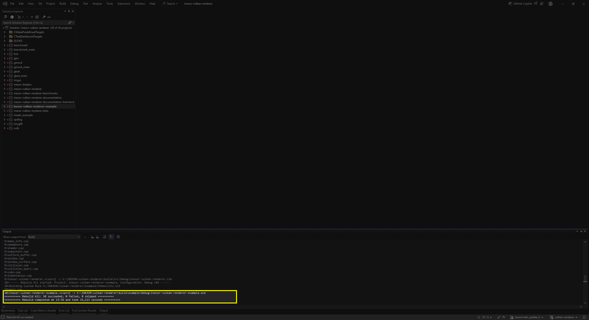

**STEP 14:** To start debugging the currently selected project, you can either press ``F5`` or click "Start Debugging":

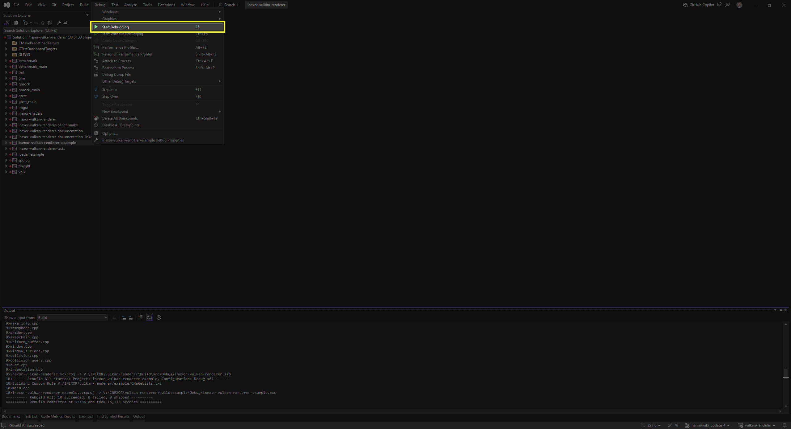

Running ``inexor-vulkan-renderer-example`` on Windows currently looks like this:

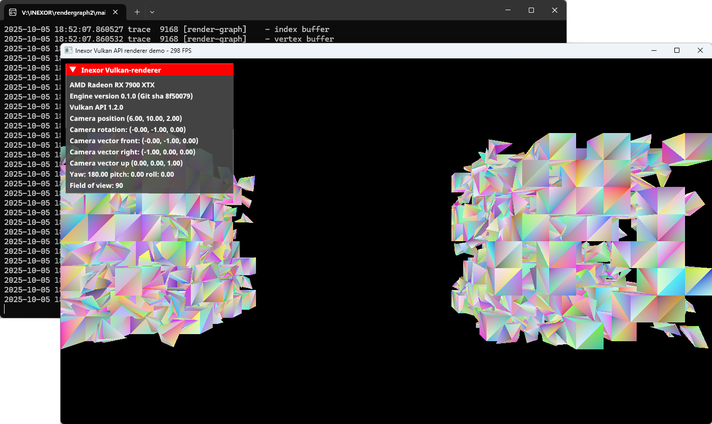

Running ``inexor-vulkan-renderer-tests`` on Windows currently gives this console output:

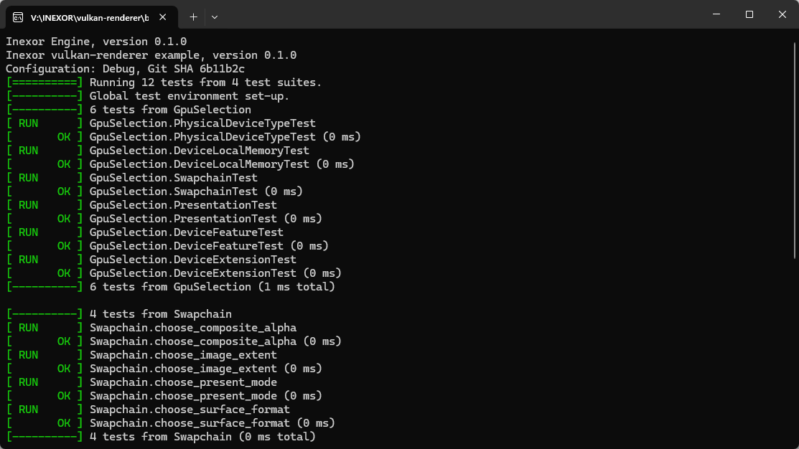

Running ``inexor-vulkan-renderer-benchmarks`` on Windows currently gives this console output:

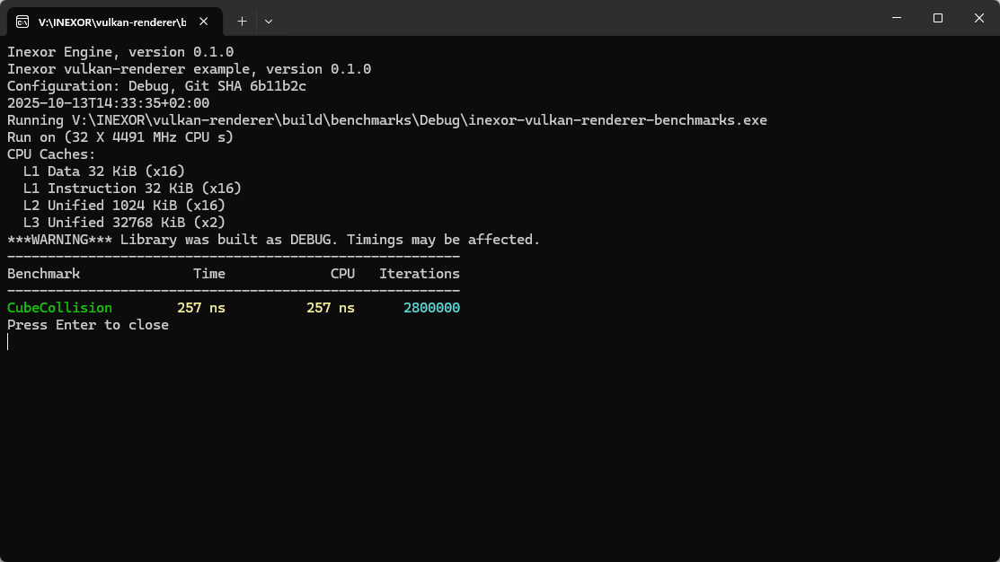

Building on Linux
-----------------

.. note::
    Of all the Linux distributions listed here, only the build instructions for Ubuntu are continuously tested. Please `open a ticket on GitHub <https://github.com/inexorgame/vulkan-renderer/issues>`__ if you have any trouble setting it up for distributions which are not tested as frequently or if you want to add build instructions for other Linux distributions!

**STEP 1:** Install dependencies and tools:

+--------+---------------------------------------+
| Ubuntu | Follow the                            |
|        | `Install the SDK`_-instructions on    |
|        | the vulkan-sdk page.                  |
|        |                                       |
|        | Install the required packages:        |
|        |                                       |
|        | .. code-block:: shell-session         |
|        |                                       |
|        |     # apt install -y \                |
|        |         pkg-config \                  |
|        |         libglm-dev \                  |
|        |         libxcb-dri3-0 \               |
|        |         libxcb-present0 \             |
|        |         libpciaccess0 \               |
|        |         libpng-dev \                  |
|        |         libxcb-keysyms1-dev \         |
|        |         libxcb-dri3-dev \             |
|        |         libx11-dev  \                 |
|        |         libmirclient-dev \            |
|        |         libwayland-dev \              |
|        |         libxrandr-dev \               |
|        |         libxcb-ewmh-dev               |
|        |     # apt install -y \                |
|        |         cmake \                       |
|        |         ninja-build \                 |
|        |         clang-tidy \                  |
|        |         vulkan-sdk \                  |
|        |         python3 \                     |
|        |         python3-pip                   |
|        |     $ pip3 install \                  |
|        |         wheel \                       |
|        |         setuptools \                  |
|        |                                       |
+--------+---------------------------------------+
| Gentoo | .. code-block:: shell-session         |
|        |                                       |
|        |     # emerge \                        |
|        |        dev-util/cmake \               |
|        |        dev-util/vulkan-headers \      |
|        |        dev-util/vulkan-tools \        |
|        |        dev-vcs/git \                  |
|        |        media-libs/vulkan-layers \     |
|        |        media-libs/vulkan-loader       |
|        |                                       |
|        |                                       |
|        | Install ninja build tool (optional):  |
|        |                                       |
|        |                                       |
|        | .. code-block:: shell-session         |
|        |                                       |
|        |     # emerge dev-util/ninja           |
+--------+---------------------------------------+
| Debian | Follow the                            |
|        | `Install the SDK`_-instructions on    |
|        | the vulkan-sdk page.                  |
|        |                                       |
|        | Install the required packages:        |
|        |                                       |
|        | .. code-block:: shell-session         |
|        |                                       |
|        |     # apt install -y \                |
|        |         libvulkan-dev \               |
|        |         glslang-dev \                 |
|        |         glslang-tools \               |
|        |         vulkan-tools \                |
|        |         vulkan-validationlayers-dev \ |
|        |         spirv-tools \                 |
|        |         pkg-config \                  |
|        |         libglm-dev \                  |
|        |         libxcb-dri3-0 \               |
|        |         libxcb-present0 \             |
|        |         libpciaccess0 \               |
|        |         libpng-dev \                  |
|        |         libxcb-keysyms1-dev \         |
|        |         libxcb-dri3-dev \             |
|        |         libx11-dev \                  |
|        |         libmirclient-dev \            |
|        |         libwayland-dev \              |
|        |         libxrandr-dev \               |
|        |         libxcb-ewmh-dev               |
|        |     # apt install -y \                |
|        |         cmake \                       |
|        |         ninja-build \                 |
|        |         clang-tidy \                  |
|        |         vulkan-sdk \                  |
|        |         python3 \                     |
|        |         python3-pip                   |
|        |     $ pip3 install \                  |
|        |         wheel \                       |
|        |         setuptools \                  |
|        |                                       |
+--------+---------------------------------------+
| Arch   | Follow the                            |
|        | `Install the SDK`_-instructions on    |
|        | the vulkan-sdk page.                  |
|        |                                       |
|        | Install the required packages:        |
|        |                                       |
|        | .. code-block:: shell-session         |
|        |                                       |
|        |     # pacman -S --noconfirm \         |
|        |         pkg-config \                  |
|        |         glslang \                     |
|        |         spirv-tools \                 |
|        |         glm \                         |
|        |         libice \                      |
|        |         libpciaccess \                |
|        |         libpng \                      |
|        |         libx11 \                      |
|        |         libxres \                     |
|        |         xkeyboard-config \            |
|        |         libxrandr \                   |
|        |         libxcb \                      |
|        |         libxaw \                      |
|        |         xcb-util \                    |
|        |         xtrans \                      |
|        |         libxvmc                       |
|        |     # pacman -S --noconfirm \         |
|        |         cmake \                       |
|        |         ninja \                       |
|        |         vulkan-headers \              |
|        |         vulkan-tools \                |
|        |         vulkan-validation-layers \    |
|        |         python3 \                     |
|        |         python-pip                    |
|        |     $ pip3 install \                  |
|        |         wheel \                       |
|        |         setuptools \                  |
|        |                                       |
+--------+---------------------------------------+
| Fedora | Install the required packages:        |
|        |                                       |
|        | .. code-block:: shell-session         |
|        |                                       |
|        |     # dnf install -y \                |
|        |         git \                         |
|        |         cmake \                       |
|        |         gcc \                         |
|        |         gcc-c++ \                     |
|        |         ninja-build \                 |
|        |         vulkan \                      |
|        |         libvkd3d \                    |
|        |         vulkan-loader-devel \         |
|        |         python3-pip \                 |
|        |         libglvnd-devel \              |
|        |         libfontenc-devel \            |
|        |         libXaw-devel \                |
|        |         libXcomposite-devel \         |
|        |         libXcursor-devel \            |
|        |         libXdmcp-devel \              |
|        |         libXtst-devel \               |
|        |         libXinerama-devel \           |
|        |         libxkbfile-devel \            |
|        |         libXrandr-devel \             |
|        |         libXres-devel \               |
|        |         libXScrnSaver-devel \         |
|        |         libXvMC-devel \               |
|        |         xorg-x11-xtrans-devel \       |
|        |         xcb-util-wm-devel \           |
|        |         xcb-util-image-devel \        |
|        |         xcb-util-keysyms-devel \      |
|        |         xcb-util-renderutil-devel \   |
|        |         libXdamage-devel \            |
|        |         libXxf86vm-devel \            |
|        |         libXv-devel \                 |
|        |         xcb-util-devel \              |
|        |         libuuid-devel \               |
|        |         xkeyboard-config-devel \      |
|        |         glslang-devel                 |
|        |                                       |
+--------+---------------------------------------+
| Other? | `Open a ticket on GitHub`__           |
+--------+---------------------------------------+

__ https://github.com/inexorgame/vulkan-renderer/issues

.. _Install the SDK: https://vulkan.lunarg.com/doc/view/latest/linux/getting_started.html

**STEP 2:** Clone the repository:

.. code-block:: shell-session

    $ git clone https://github.com/inexorgame/vulkan-renderer
    $ cd vulkan-renderer

**STEP 3:** Configure CMake:

.. code-block:: shell-session

    $ cmake . --Bbuild --DCMAKE_BUILD_TYPE=Debug

You can pass ``--GNinja`` if Ninja build system is installed:

.. code-block:: shell-session

    $ cmake . --Bbuild --GNinja --DCMAKE_BUILD_TYPE=Debug

**STEP 4:** Build and run:

.. code-block:: shell-session

    $ cmake --build build --target inexor-vulkan-renderer-example
    $ ./build/example/inexor-vulkan-renderer-example
