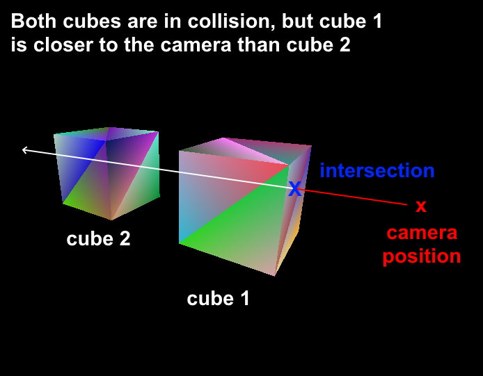
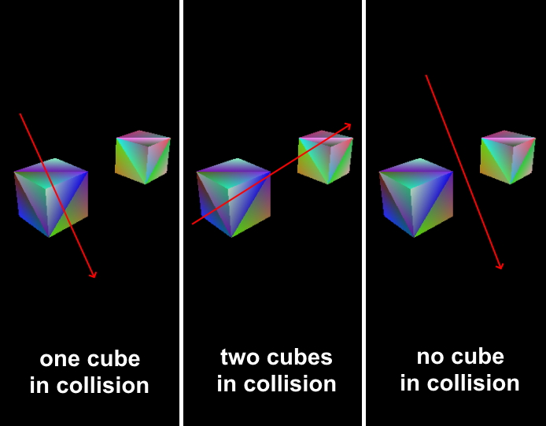
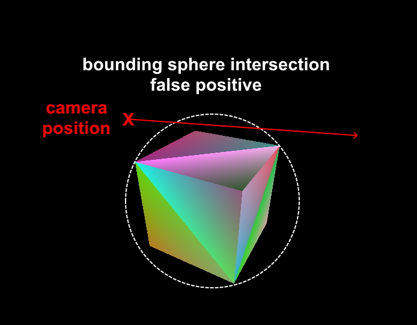
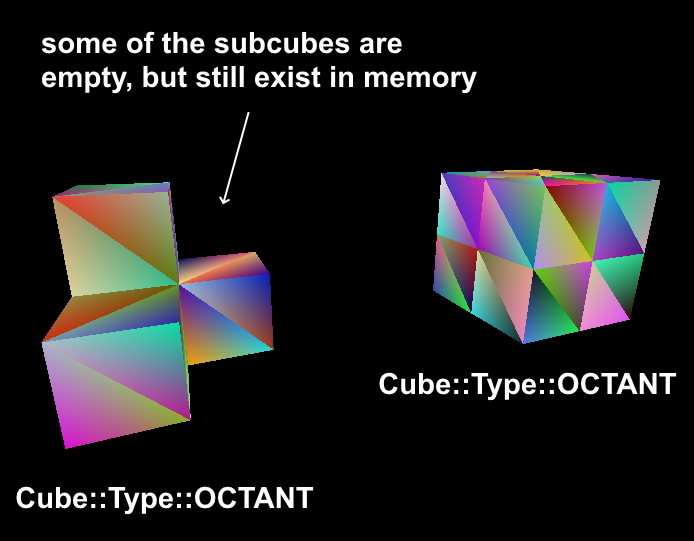
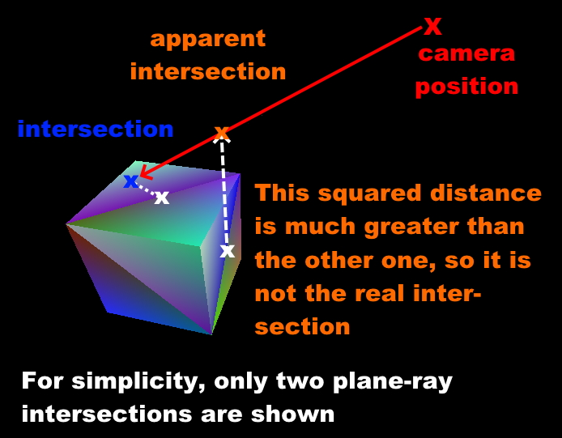

Multi octree collision detection
================================

Octree collision detection allows us to find intersections between octree geometry and a ray, for example the camera view ray. This is an essential part for the octree editor. Inexor engine allows to have multiple octrees with arbitrary position and relative size (no support for rotations yet), making collision detection significantly more complex than single octree traversal:

.. image:: octree_collision_sizes.jpg
    :width: 500
    :alt: Multiple octrees with different relative size.

In the following screenshot, you can see three octrees of different types and different sizes. The octree in the left has 8 sub-cubes (we call a cube which has 8 children ``Cube::Type::OCTANT`` in the engine, even if some of them are empty). The one octree in the midle has no children, it's just one solid cube (we call it ``Cube::Type::SOLID``). The one in the right has some empty and some solid sub-cubes in it (that's also an ``Cube::Type::OCTANT``). You can see that these cubes are not indented at all, because indentation is not taken into account yet for octree collision. [#f1]_

.. image:: octree_collision_multiple_octrees.jpg
    :width: 500
    :alt: Multiple octrees with different relative size.

How to find collisions between octree geometry and a ray in this scene now? For simplicity, we assume that the octrees are not intersecting each other. Let's assume we want to write an octree editor. We are obviously only interested in the intersection which is closest to the camera's position: if there is another octree behind the current selection, we must move the camera to it, in order to be able to edit it: [#f2]_

We are also only interested in collisions which are in front of our camera view:

.. image:: octree_collision_only_front_collisions.jpg
    :width: 500
    :alt: We are interested in the collision in front of the camera.

Let's imagine we now have :math:`N` octrees, and we want to find all those which collide with the ray and we want to know the one which is closest to the camera. Furthermore, since we want to write an octree editor, we want not only the cube which is in selection, but we also want to know which one of the 6 faces of the cube is in selection. In addition, we want to know the coordinates or the intersection between camera ray and the plane of the selected face. We also need the closest corner on the selected face and the closest edge, just so we have all the data we could possibly need for implementing the editor. This leaves us the following questions:

- How do we even determine if there are any collisions occuring at all?
- How do we now find out which of the :math:`N` octrees is in selection?
- How do we determine the octree which is closest to our camera's position?

Finding the octree closest to the camera
----------------------------------------

Assuming we have :math:`N` octrees, the first thing we do is to iterate through every one of the :math:`N` octrees and to check for collision of the camera ray with the bounding sphere of the octree. This is a quick way to optimize the collision in the beginning and to save a lot of computation time. It is a common trick in computer graphics. If we would check for every possible collision without this step, the algorithm would be way too slow. So we need to iterate through the :math:`N` octrees we have and calculate the distance :math:`d` between the ray and the center of the octree's bounding sphere. In our engine, the center of the octree is also the center of the bounding sphere. We are using  `glm::intersectRaySphere <https://glm.g-truc.net/0.9.5/api/a00203.html>`__ to check if a collision is happening. If the bounding sphere check was successful, we also check collision of the ray with the `axis aligned bounding box (aabb) <https://developer.mozilla.org/en-US/docs/Games/Techniques/3D_collision_detection#axis-aligned_bounding_boxes>`__. This check is more expensive but also more precise than the bounding sphere check. However it is only used if the bounding sphere check previously was successful to save performance.

.. note::
    Simply iterating through all :math:`N` octrees is a naive approach. This only works for small number of octrees. Much better would be to use a hierarchical data structure like a `bounding volume hierarchy <https://en.wikipedia.org/wiki/Bounding_volume_hierarchy>`__, which groups objects which are close to each other into a unified bounding sphere. This hierarchical bounding sphere check is much faster than iterating through all :math:`N` octrees. There are libraries which could help implement this for Inexor in the future.

.. note::
    Currently we use the entire octree as axis `axis aligned bounding box (aabb) <https://developer.mozilla.org/en-US/docs/Games/Techniques/3D_collision_detection#axis-aligned_bounding_boxes>`__. However, we could optimize this: We could fit the bounding box to only the filled cubes of that octree. For example if one half side of the octree is empty, we could adjust the bounding box to the other half. If a camera ray now collides with the empty part of the octree, this could give us improved performance, as the bounding box is not hit. Otherwise the subcube iteration would be executed and come to the same conclusion: only empty subcubes are hit and therefore no collision takes place.

After this step, we have :math:`0` to :math:`N` octrees which collide with the ray. The following screenshot shows the possible situations for :math:`N=2`:

If we have :math:`0` collisions, we can already stop collision detection here because there are no collisions occuring: if a camera ray intersects an octree, it must also intersect the bounding sphere. The reverse statement is not true: if a ray collides with a bounding sphere, that does not mean it collides with the octree. It could be a false positive:
    

We now need to find the octree which is closest the camera. Even if the camera is inside of an octree, there could be multiple octrees which have bounding spheres that intersect the camera ray. The first thing which comes to our mind is sorting the octrees by distance to the camera: we could calculate the distance :math:`d` between camera's position and bounding sphere's center (= the octree's center) for every one octree which intersects with the camera ray and order them by distance:

:math:`d = \sqrt{(x_1 - x_2)^2 +(y_1 - y_2)^2 +(z_1 - z_2)^2}`

The one with the lowest distance will be the one which is closest to the camera. This should be the octree we will perform any further detailed collision checks on. However, there are two things we can already optimize here.

The square of the distance
--------------------------

First, we do not need to sort the octrees by distance. Sorting would mean we need all of the data sorted by distance. We are only interested in the octree with the smallest distance though. Since we iterate through all of them, we check if the calculated distance :math:`d` between bounding sphere's center and camera position is smaller than the stored value, and if that is the case, store it as the new closest octree. [#f3]_ This is significantly faster than sorting all octrees. We also lose information about the distance to all the other octrees in selection, but that's not important at the moment (at least for the octree editor that is irrelevant for now). As a second optimization, we should not calculate the distance :math:`d` between the bounding sphere's center and the camera's center, as we are not interested in the exact value of the distance. The reason we should avoid this is because distance calculation using `glm::distance <https://glm.g-truc.net/0.9.4/api/a00131.html#ga3fac0e61144f60184d961dd156709dd3>`__ makes an expensive `sqrt <https://www.cplusplus.com/reference/cmath/sqrt/>`__ call, as it needs to calculate the distance like this:

:math:`d = \sqrt{(x_1 - x_2)^2 +(y_1 - y_2)^2 +(z_1 - z_2)^2}`

If we take this equation and square both sides, we obtain :math:`{d}^2`, the squared distance:

:math:`{d}^2 = {(x_1 - x_2)^2+ (y_1 - y_2)^2+ (z_1 - z_2)^2}`

This way, we **perform no square root calculation**. The squared distance :math:`{d}^2` will serve as our value for determination of the closest octree. Think about it: if the distance :math:`d` is the value which allows us to find the closest octree, the square of the distance :math:`{d}^2` will work as well. If you take :math:`N` octrees, each one having a distance :math:`d` to the camera's position, the order will not change if we square the distance.

.. note::
    For simplicity, we assume that the octrees have a variable position and size, but are **not intersecting each other**. If that is the case, the determination of the octree which is closest to the camera would be more complicated. For example if there would be two octrees, one being closer to the camera than the other, but the one further away has a bigger size, maybe resulting in faces which are closer to the camera than the other cube. We will implement support for this in the future.

Finding the leaf node
---------------------

Now that we have found the octree which is closest to the camera, we need to find a leaf node in the octree which is being intersected. The most simple case would be if the octree's root is of type ``Cube::Type::SOLID``, as completely filled octrees are leaf nodes by definition:

.. image:: octree_collision_filled.jpg
    :width: 500
    :alt: An octree of type ``Cube::Type::SOLID``.

If the octree's root is of type ``Cube::Type::OCTANT``, we need to iterate through all 8 sub-cubes. This is described in the next section.

Please note that every octant has 8 sub-cubes, even if some (or even all) of them are of type ``Cube::Type::EMPTY``. [#f4]_

.. note::
    Technically, the octree's root could also be of type ``Cube::Type::EMPTY``. In this case, there also no collision possible. However, such octrees will be skipped when iterating through all possible sub-cubes which could possibly collide with the ray.

Subcube iteration
-----------------

So we found the octree which is closest to the camera, but it's neither completely empty (``Cube::Type::EMPTY``) nor completely filled (``Cube::Type::OCTANT``). We now simply iterate through all 8 sub-cubes and repeat the bounding sphere and axis aligned bounding box collision checks for every subcube. If a subcube is empty, no collision with it is possible and it will be excluded from detailed collision checks. We now need to find the sub-cube which is closest to the camera again. We therefore perform the same search by squared distance as we already did for the octree octrees. We simply calculate the squared distance from the center of the sub-cube to the camera and if the distance is lower than the one which is currently stored, we accept it as new closest sub-cube. Imagine a cube is an octant and it has 8 sub-cubes which are all not empty. If a ray goes through that cube, no more than 4 sub-cubes can be intersected. Therefore we abort the hit collection after 4 hits. Once we determined the sub-cube which is closest to the camera, we recursively perform this algorithm. The iteration depth can be limited in the engine. A common example of this is the grid size of the octree editor. So a leaf node is either found if the current subcube is of type ``Cube::Type::SOLID`` or if the iteration depth has been reached. Once a leaf cube was found, we proceed to calculate the selected face, as described in the following section.

.. note::
    Every cube of type ``Cube::Type::OCTANT`` has 8 subcubes. Iterating through all subcubes from index :math:`0` to :math:`7` is a naive approach as well. Inexor should use a fast octree traversal algorithm in the future. For more information, check out `this paper <https://www.google.de/url?sa=t&rct=j&q=&esrc=s&source=web&cd=&ved=2ahUKEwjo_q2r_IXwAhVPhf0HHWIqD_4QFjACegQIBBAD&url=https%3A%2F%2Flsi.ugr.es%2Fcurena%2Finves%2Fwscg00%2Frevelles-wscg00.pdf&usg=AOvVaw2v-0fVjo4RIDujC0NrJnHM>`__. Also check out the `hero algorithm <https://www.google.de/url?sa=t&rct=j&q=&esrc=s&source=web&cd=&ved=2ahUKEwiaoYvhi4bwAhXJhv0HHdpJC1YQFjABegQIBRAD&url=https%3A%2F%2Fdiglib.eg.org%2Fbitstream%2Fhandle%2F10.2312%2FEGGH.EGGH89.061-073%2F061-073.pdf%3Fsequence%3D1%26isAllowed%3Dy&usg=AOvVaw0dbLPIu7T1Cv-e1nO6wF0s>`__.

Determination of selected face
------------------------------

Now that we have found the selected cube, we need to determine on which one of the 6 faces (left, right, top, bottom, front, back) the collision takes place. We are only interested in the intersection which is facing the camera. That is also the intersection which is closer to the camera position. There is also a backside intersection from the outgoing ray, but we are not interested in this for now. There are several ways how to determine which face is in collision. We decided to use the following approach: first we filter out all sides of the cube which are not facing the camera. In order to do so, let's take a look at the following equation which describes the angle :math:`\alpha` of two vectors :math:`\vec{a}` and :math:`\vec{a}`:

:math:`cos(\alpha) = \frac{\vec{a}\cdot\vec{b}}{|a| \cdot |b|}`

If we define :math:`\vec{a}` as the normal vector on the face and :math:`\vec{b}` as the camera direction vector, we realize that the normal vector on the cube's face is no longer facing the camera if the angle :math:`\alpha` becomes greater than ``90 degrees``. We now think we should rearrange for the angle:

:math:`\alpha = cos^{-1}\left(\frac{\vec{a}\cdot\vec{b}}{|a| \cdot |b|}\right)`

However, we can simplify this: If the angle is slightly greater than ``90 degrees``, the value of :math:`cos(\alpha)` becomes smaller than ``0``. If the angle is a little less than ``90 degrees``, :math:`cos(\alpha)` becomes greater than ``0``. If we take a look at the right side of the equation we started with, we can see that the dot product of :math:`\vec{a}` and :math:`\vec{b}` is in the nominator while the product of the magnitudes is in the denominator. Since the magnitude of a vector is never negative, the product of two magnitudes will always be positive. We now see that the sign change is entirely dictated by the nominator. Furthermore, we already elaborated that it's comparably expensive to calculate the square root. We can simplify all this to the following condition: the face on a cube is visible, if the dot product of the two vectors :math:`\vec{a}` and :math:`\vec{b}` is smaller than zero:

:math:`\alpha < 0` for :math:`\vec{a}\cdot\vec{b} < 0`

This is quite nice, because the dot product of :math:`\vec{a}` and :math:`\vec{b}` is a cheap calculation. This is another very popular trick in computer graphics. [#f5]_

We now simply iterate through all 6 faces of the cube, take the normal vector on that cube face and check if it's facing the camera. We are only interested in the planes which are facing the camera. [#f6]_ If you look at a cube, no more than 3 sides can be visible at the same time. This means we can stop after we found 3 cube sides which are facing the camera. It could be less than 3 sides though. Imagine you are right on top of a solid cube and your look down on it, only the top side is visible. If you look from a certain position, only 2 sides are visible.

.. image:: octree_collision_cube_facing_camera.jpg
    :width: 500
    :alt: No more than 3 sides of a cube can be seen. It could be less though.

.. note::
    We could optimize this in the future by doing some coordinate checks of the camera and the octree. For example if the ``x`` and ``y`` coordinates are inside the square of the cube, we could only see top or bottom of the cube. However, since Inexor wants to account for arbitrary rotations around all 3 axis, this is more complex than for unrotated octrees. We think our current solution is sufficiently performant.

We now have 3 or less sides of the cube facing the camera. We calculate the intersection point between the ray and every plane which represents a cube face. In order to determine the real intersection, we come back to searching the lowest squared distance again. However, it is important to state that we can't use the squared distance to the camera position in this case. We must calculate the squared distance between the intersection point on every plane and the center of the cube's face which is associated to this plane. This way, we find the real intersection point and the selected corner:

Calculation of closest corner
-----------------------------

We now successfully determined the selected face and the intersection point. We already know the coordinates of every one of the 4 corners on that face. In order to determine the nearest corner, we come back to calculating the squared distance between the intersection point and every corner point. The corner with the lowest squared distance is the nearest.

.. image:: octree_collision_nearest_corner.jpg
    :width: 500
    :alt: Possible intersections.

Calculation of closest edge
---------------------------

The determination of the closest edge works the same way as the determination of the closest corner: searching the lowest squared distance between intersection point and center of the four edges on the selected face. To find the edges which are associated to the selected size, the following array is used. The indices of edges are the same as in the octree documentation:

.. code-block:: cpp

    using edge_on_face_index = std::array<std::size_t, 4>;
    
    // These indices specify which 4 edges are associated with a given face of the bounding box.
    static constexpr std::array BBOX_EDGE_ON_FACE_INDICES{
        edge_on_face_index{0, 1, 2, 3},   // left
        edge_on_face_index{4, 5, 6, 7},   // right
        edge_on_face_index{1, 5, 8, 11},  // front
        edge_on_face_index{3, 7, 9, 11},  // back
        edge_on_face_index{0, 4, 10, 11}, // top
        edge_on_face_index{2, 6, 8, 9}    // bottom
    };

Closing remarks
---------------

With this algorithm, we have a good starting point writing an octree editor. However, we know that this is not the fastest solution possible. Nevertheless, it is a solution which is easy to understand, easy to improve and easy to optimize for sure. Furthermore, it will be easy to parallelize it. All the aspects which could be improved have been listed on this page.

.. rubric:: Footnotes

.. [#f1] The current implementation of octree-ray intersection only checks for intersections with completely filled cubes and does not take into account indentations of cubes, as this is not required for an octree editor. The bounding box of an octree is always unchanged, even if the octree geometry itself has indentations. Taking into account indentations will be required for physics calculations in the future, for example to check collisions between particles and octree.

.. [#f2] We could also make the layer which is blocking view invisible for a moment in the future.

.. [#f3] To do so, we need to set the initial value of the distance to a maximum value. We use ``std::numeric_limits<float>::max()``

.. [#f4] This has to do with the way the engine lays out memory for the octree data structure. The engine will allocate memory for the empty sub-cube because it's faster to change the sub-cube's data if it gets modified. However, empty sub-cubes will not result in additional vertex or index data being generated.

.. [#f5] In fact this is used during the rasterization step in rendering to discard all triangles which are not facing the camera.

.. [#f6] For some reasons we might be interested in those sides of a cube which are not facing the camera in the future?
